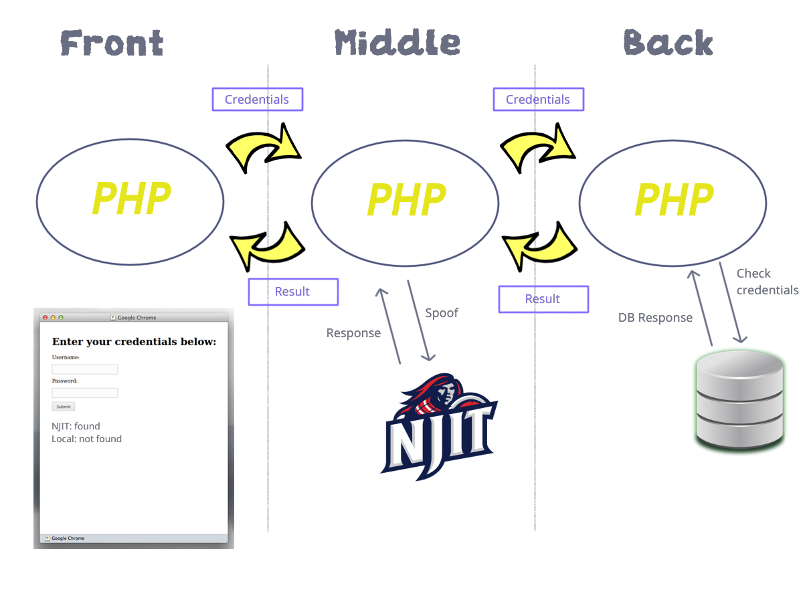

# CS490 Project - Frontend

The frontend to our (unnamed as of right now) CS490 project.

### Architecture



### Layout
Each php script can be either a `sender+receiver` or a `receiver`.

A `sender+receiver` is a php script which will use `cURL` to "send" some data to another script and will have some data "returned" to it by the script they called. Front and Mid both belong to this category.

A `receiver` is a php script that doesn't use `cURL` to communicate to another script: it simply gets passed some data from another script, performs some logic on it, and returns some data to the script that called it. Back belongs to this category.

#### Sender-receiver code skeleton
```php
<?php
    //receives data from calling script/document via $_POST
    $v = $_POST['credentials'];

    //performs some optional initial logic with the data
    //i.e hashing, etc.

    //Sends data to "next in chain" script
    $ch = curl_init();
    
    //@TODO: update with correct "following" php path
    curl_setopt($ch, CURLOPT_URL, "the_php_target.php"); 
    curl_setopt($ch, CURLOPT_POST, TRUE);
    //$v may have been modified - it's the data you send to the next script
    curl_setopt($ch, CURLOPT_POSTFIELDS, "credentials=" . $v);
    curl_setopt($ch, CURLOPT_RETURNTRANSFER, TRUE);

    //Get the result from the execution (what the "NiC" script will return)
    $output = curl_exec($ch);
    if($output === false)
        echo 'Curl error: ' . curl_error($ch);
    else {
        //If no errors, (optionally modify/apply logic) and return data to the script that called you
        echo $output;
    }
    
    curl_close($ch);
?>
```

#### Receiver code skeleton
```php
<?php
    //receives data from calling script/document via $_POST
    $v = $_POST['credentials'];

    //performs some optional initial logic with the data
    //i.e hashing, etc.

    //DOES NOT CALL CURL - it is the "last in line"
    //Simply returns what it wants to pass onto its caller
    $output = '{"njit":"", "local":"false"}';
    echo $output
?>
```

#### Specific Chain of Events
1. Front reads input from HTML, passes a `Credentials` JSON object to `front.php` with username and plaintext password.
2. `front.php` gets this `Credentials` and passes it onto Middle in `mid.php`.
3. Middle gets this `Credentials` and performs spoof logic to NJIT with them and keeps track of the outcome. 
4. While doing #3, it makes an extra copy of `Credentials`, and replaces the plaintext password with a hashed one (via php's `hash()`). Middle sends this "hashed" `Credentials` object and passes it onto Back in `back.php`.
5. Back gets this "hashed" `Credentials` and compares the hashed password to the hashed password on the DB. Based on the result, Back prepares a partially complete `Result` JSON object (with only the local result) and returns it.
6. Middle gets this returned `Result`, and completes the `Result` by adding the outcome of the NJIT spoof. It returns this complete `Result`.
7. Frontend receives this `Result`, and returns it.
8. Within JS, a function is called to update the view on the browser based on the `Result`.

### Data
Will send a `Credentials` JSON object to Middle.
```json
{
    "user": user_name,
    "password": their_hashed_password
}
```

Expects a `Result` JSON object from Middle.
```json 
{
    "njit" : "success",
    "local" : "failure"
}
```