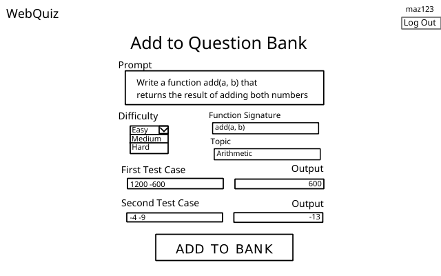

## View Question Bank

#### Overview
An instructor will be able to add questions in the question bank. The prompt, topic, test cases, and outputs must be of correct length to avoid unintended truncation. If all input is valid, the question is added to the question bank. 

#### File Structure
```
./
  |- back/
    |- data.php
  |- front/
    |- data.php
    |- qadd.css
    |- qadd.html
    |- qadd.js
  |- mid/
    |- data.php
```

#### View


##### Elements
- Website header with "Log Out" button
- Webpage title for the current page
- Optional popup to display error messages
- An input area for the prompt
- A select element with all the difficulty options
- An input area for function signature
- An input area for topic
- An input area for first test case
- An input area for (first test case) output
- An input area for second test case
- An input area for (second test case) output

#### Script
- Ensure that there is an `userType` cookie set and `userType == instructor`
  - If `userType` doesn't exist or `userType != instructor`, redirect to [login page](docs/identification.md).
- This page is a static template that the user gives input to.
- The prompt must be validated to be of length <= 128.
- Function signature must be validated to be of length <= 64 and be **matched exactly** in the prompt.
- Topic must be validated to be of length <= 32.
- First test case must be validated to be of length <= 64.
- First test case output must be validated to be of length <= 64.
- Second test case must be validated to be of length <= 64.
- Second test case output must be validated to be of length <= 64.
- Selecting an item on the select element for difficulty will set that element's value to a local `difficulty` variable.
- When "Add to Bank" button is clicked, function `validateInput()` is ran to perform all validation tasks listed above.
- Function `validateInput()` looks through each element in the static page and checks if all validation tests are successful.
    - If successful, question is sent to DB to be added.
        - If result from DB is successful, redirect to `instructor.html`.

If any of above functions fail, for whatever reason, an error message is displayed on a pop-up window and the page is reloaded.

#### Data
To get the data for questions, we must follow the usual chain of communication between the endpoints.

- Front's `student.js` sends a `POST` request with `question=(Question JSON string)` to Front's `data.php`.
- Front's `data.php` passes the same request along to Mid's `data.php`.
- Mid's `data.php` passes the same request along to Back's `data.php`.
- Back's `data.php` performs the [PUT IN QUESTION BANK](../back/queries.sql) query and returns a `Result` as a JSON string.
- Mid's `data.php` passes the `BankInfo` JSON string to Front's `data.php`.
- Front's `data.php` passes the `BankInfo` JSON string to Front's `student.json`.

##### Question
```json
{
    "id": "1a3b...",
    "prompt": "Write a function ...",
    "functionSignature": "add(a, b)",
    "difficulty": 0,
    "topic": "Arithmetic",
    "creatorID": "5a3s...",
    "firstTestCase": "1200 -600",
    "firstOutput": "600",
    "secondTestCase": "-4 -9",
    "secondOutput": "-13"
}
```

##### Result
```json
{
    "result": "success"
}
```