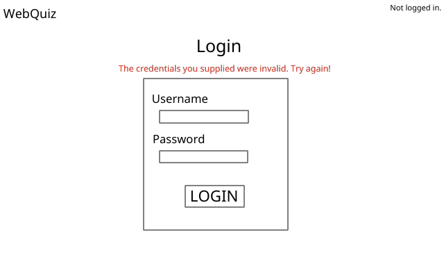

## Identification

#### Overview
A potential user is met by a login screen that will attempt to identify who the user is, and what type (`student` or `instructor`) that user is. If the credentials entered by the user are correct, they will be redirected to either their [student home page](docs/student_home.md) or their [instructor home page](docs/instructor_home.md).

#### File Structure
```
./
  |- back/
    |- login.php
  |- front/
    |- login.css
    |- login.html
    |- login.js
    |- login.php
  |- mid/
    |- login.php
```

#### View


##### Elements
- Website header without "Log Out" button
- Webpage title for the current page
- Optional error label to be used for displaying error messages
- Input Box
  - label and input for username
  - label and input for password
  - button to attempt to log in

#### Script
- Ensure that there is no `userType` cookie set.
  - If `userType == student`, redirect to [student home page](docs/student_home.md).
  - If `userType == instructor`, redirect to [instructor home page](docs/instructor_home.md).

- Once the `LOGIN` button is clicked, package user input into a Credentials JSON string and check to see if they are valid. If they are, set `userType`, `userName`, and `dbID` cookies appropriately, and redirect user to their homepage. If they're not, display an error message on the error label.

#### Data 
To check whether the credentials are valid, we must talk to the database (and therefore the Back End). However, since this is for identification purposes and not the core of the application, we will communicate across `login.php` between endpoints.

- Front's `login.js` sends a `POST` request with `credentials=(Credentials object as JSON string)` to Front's `login.php`.
- Front's `login.php` passes the same request along to Mid's `login.php`.
- Mid's `login.php` modifies the `Credentials` object to store the hashed password (sha256), and sends a `POST` request with `credentials=(Modified Credentials object as JSON string)` to Back's `login.php`.
- Back's `login.php` performs the [LOGIN query](../back/queries.sql) to check for credentials, and returns a `Result` object.
- Mid's `login.php` passes the `Result` to Front's `login.php`.
- Front's `login.php` passes the `Result` to Front's `login.js`.

##### Credentials
```json
{
  "name": "ab123",
  "plain_password": "1234"
}
```

##### Modified Credentials
```json
{
  "name": "ab123",
  "hashed_password": "89a7..."
}
```

##### Result
```json
{
  "result": "success",
  "type": "student",
  "id": "1a35..."
}
``` 