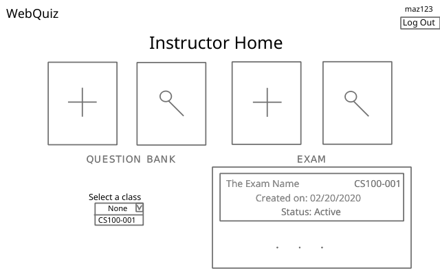

## Instructor Home

#### Overview
The instructor homepage is where an instructor can access the question bank (view or add a question to it), create a new exam, or view exams.  When viewing  exams, the instructor will have different options based on the status of the exam; they will be able to either start autograding, give feedback, or release the scores to students. These will be discussed in detail on their own documentation.

#### File Structure
```
./
  |- back/
    |- data.php
  |- front/
    |- data.php
    |- instructor.css
    |- instructor.html
    |- instructor.js
  |- mid/
    |- data.php
```

#### View


##### Elements
- Website header with "Log Out" button
- Webpage title for the current page
- Optional popup to display error messages
- An `InstructorAction` container with 4 buttons, one for each instructor action
    - Add to question bank
    - View question bank
    - Create an exam
    - View exams
- A select element with all the classes the user is in
- A bottom flexbox with `VisualExam` elements
    - Each `VisualExam` consists of a `<div>` with the id of `ve#` where # is the index of the exam on the local exam array, a class of `visualExam`, and it's details as shown above.
    - Each time that a button on the select element is selected, the right flexbox is re-rendered accordingly.

#### Script
- Ensure that there is an `userType` cookie set and `userType == instructor`
  - If `userType` doesn't exist or `userType != instructor`, redirect to [login page](docs/identification.md).
- Depending on the button clicked on `InstructionAction` container 4 things can happen:
    - instructor clicks "add question bank"
        - redirect to [add question bank](add_bank.md).
    - instructor clicks "view question bank"
        - redirect to [view question bank](view_bank.md).
    - instructor clicks "add exam"
        - redirect to [add exam](add_exam.md).
    - instructor clicks "view exam"
        - sets the select element and bottom flexbox visible.
- The page needs two things to be rendered:
    - Class information - the id, course and section
    - Exam information - the exam id, exam name, exam date, class course, class section, exam status.
    - Note: both are necessary since they do separate tasks: classes info is to render the dropdown list to select class, exam information is to populate an array later used to render the right flexbox with `VisualExam` elements. An instructor can be in a class but have no exams created for it.
- To gather that data, function `getPageRenderData()` is called. This has the following effects if successful:
    - Populate a `classList` local array with the `id`, `course`, and `section` for each class the instructor is in.
    - Populate an `examList` local array with the `id`, `name`, `date`, `course`, `section`, `status` for each *distinct* exam the instructor is associated with.
    - Call `renderPageElement('classes')`.
    - Call `renderPageElement('exams')`.
- Selecting an item on the class list will set a local variable `activeClassID` to hold the ID of the class the user selected, and will cause `renderPageElement('exams')` to be called.
- Selecting an item on the bottom flexbox will set a cookie `activeReviewExam` with the clicked exam ID and redirect the instructor to [view that exam](docs/grade_exam.md).
- Function `getPageRenderData()` will communicate the data it wants and will get it from the database by following the usual chain between endpoints.
- Function `renderPageElement()` will render the type of element that is called to the webpage
    - For 'classes', it will simply assign an element to the class list for each class in the `classList` array.
    - For 'exams', it will use the `activeClassID` variable to filter the `examList` array to hold only those exams with the specified class and then assign their `VisualExam` elements to the bottom flexbox.
    - Note: `filter()` method returns a new array so there is no need risk of losing track of the other exams in the `examList` array.


If any of above functions fail, for whatever reason, an error message is displayed on a pop-up window and the page is reloaded.

#### Data
To get the data for classes and exams, we must follow the usual chain of communication between the endpoints.

- Front's `instructor.js` sends a `GET` request with `data=home&instructor=(id)` to Front's `data.php`.
- Front's `data.php` passes the same request along to Mid's `data.php`.
- Mid's `data.php` passes the same request along to Back's `data.php`.
- Back's `data.php` performs both [GET CLASSES and GET EXAMS](../back/queries.sql) queries for the instructor and returns a `HomeInfo` array as a JSON string, which consists of class and exam data.
- Mid's `data.php` passes the `HomeInfo` JSON string to Front's `data.php`.
- Front's `data.php` passes the `HomeInfo` JSON string to Front's `instructor.js`.

##### HomeInfo Array
```json
[
    /* the first element of the HomeInfo array is the classList */
    [
        {
        "id": "f9dd048a-6af7-11ea-bed6-b827eb031409",
        "course": "CS100",
        "section": "001"
        },
        /* ... */
    ],
    /* the second element of the HomeInfo array is the examList */
    [
        {
        "id": "a371eb52-acf3-4552-9def-8af8cd47bb59",
        "name": "First Semester Quiz",
        "date": "2020-03-20 22:25:16",
        "course": "CS100",
        "section": "001"
        },
        /* ... */
    ]
]
```