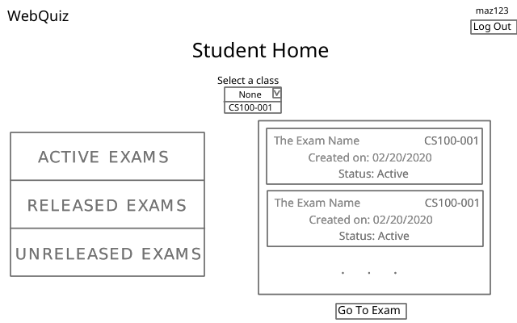

## Student Home

#### Overview
The student homepage is where a student can access any of their available, and released exams. An active exam is one the student hasn't taken yet, and needs to take. A released exam is an exam that has been autograded by the grading system and reviewed by the instructor. The student has the option to display these exams for one specific class or for all classes they are a part of.

#### File Structure
```
./
  |- back/
    |- data.php
  |- front/
    |- data.php
    |- student.css
    |- student.html
    |- student.js
  |- mid/
    |- data.php
```

#### View


#### Elements
- Website header with "Log Out" button
- Webpage title for the current page
- Optional popup to display error messages
- A select element with all the classes the user is in
- A left flexbox with three buttons
    - Active exams: selects active exams to be rendered only.
    - Released exams: selects released exams to be rendered only.
    - Unreleased exams: selects unreleased exams to be rendered only.
- A right flexbox with `VisualExam` elements
    - Each `VisualExam` consists of a `<div>` with the id of `ve#` where # is the index of the exam on the local exam array, a class of `visualExam`, and it's details as shown above.
    - Each time that a button on the left flexbox is selected or a new element is selected on the select element, the right flexbox is re-rendered accordingly.
- A "Go To Exam" button that will attempt to access the currently selected (`activeExamID`) exam. The way the exam is accessed and the requirements to access it will be different depending on their status.

#### Script
- Ensure that there is an `userType` cookie set and `userType == student`
  - If `userType` doesn't exist or `userType != student`, redirect to [login page](docs/identification.md).
- The page needs two things to be rendered:
    - Class information - the id, course and section
    - Exam information - the exam id, exam name, exam date, class course, class section, exam status.
    - Note: both are necessary since they do separate tasks: classes info is to render the dropdown list to select class, exam information is to populate an array later used to render the right flexbox with `VisualExam` elements. A student can be in a class but have no exams assigned for it.
- To gather that data, function `getPageRenderData()` is called. This has the following effects if successful:
    - Populate a `classList` local array with the `id`, `course`, and `section` for each class the student is in.
    - Populate an `examList` local array with the `id`, `name`, `date`, `course`, `section`, `status` for each *distinct* exam the student is associated with.
    - Call `renderPageElement('classes')`.
    - Call `renderPageElement('exams')`.
- Selecting an item on the class list will set a local variable `activeClassID` to hold the ID of the class the user selected, and will cause `renderPageElement('exams')` to be called.
- Selecting an item on the left flexbox will set a local variable `activeExamType` to hold the status of the currently selected exam type, and cause `renderPageElement('exams')` to be called.
- Selecting an item on the right flexbox will set a local variable `activeExamID` to hold the ID of the exam the user clicked on.
- Function `getPageRenderData()` will communicate the data it wants and will get it from the database by following the usual chain between endpoints.
- Function `renderPageElement()` will render the type of element that is called to the webpage
    - For 'classes', it will simply assign an element to the class list for each class in the `classList` array.
    - For 'exams', it will use the `activeExamType` variable to filter the `examList` array to hold only those exams with the specified status and then assign their `VisualExam` elements to the right flexbox.
    - Note: `filter()` method returns a new array so there is no need risk of losing track of the other exams in the `examList` array.
- Clicking the "Go To Exam" button has different possibilities based on the `activeExamType`:
    - status == "released"
        - cookie `activeReviewExam` is set to the value of the clicked exam ID (`activeExamID`) and student is redirected to [review exam results](docs/review_exam.md).
    - status == "unreleased"
        - error popup is displayed with error message that the exam is not ready for review yet
    - status == "active"
        - cookie `activeReviewExam` is set to the value of the clicked exam ID (`activeExamID`) and student is redirected to [take the exam](docs/take_exam.md).
    
    The above logic is handled by function `evaluateStudentChoice()`.

If any of above functions fail, for whatever reason, an error message is displayed on a pop-up window and the page is reloaded.

#### Data
To get the data for classes and exams, we must follow the usual chain of communication between the endpoints.

- Front's `student.js` sends a `GET` request with `data=home&student=(id)` to Front's `data.php`.
- Front's `data.php` passes the same request along to Mid's `data.php`.
- Mid's `data.php` passes the same request along to Back's `data.php`.
- Back's `data.php` performs both [GET CLASSES and GET EXAMS](../back/queries.sql) queries for the student and returns a `HomeInfo` array as a JSON string, which consists of class and exam data.
- Mid's `data.php` passes the `HomeInfo` JSON string to Front's `data.php`.
- Front's `data.php` passes the `HomeInfo` JSON string to Front's `student.json`.

##### HomeInfo Array
```json
[
    /* the first element of the HomeInfo array is the classList */
    [
        {
        "id": "f9dd048a-6af7-11ea-bed6-b827eb031409",
        "course": "CS100",
        "section": "001"
        },
        /* ... */
    ],
    /* the second element of the HomeInfo array is the examList */
    [
        {
        "id": "a371eb52-acf3-4552-9def-8af8cd47bb59",
        "name": "First Semester Quiz",
        "date": "2020-03-20 22:25:16",
        "course": "CS100",
        "section": "001",
        "status": 3
        },
        /* ... */
    ]
]
```